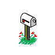
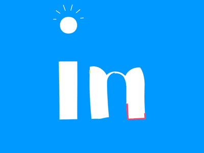
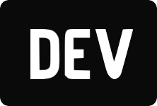

# <div align="center"></div>

## I'm Sandra Samy :)

> Mobile-first engineer. DevOps enthusiast. Stack-agnostic.

📍Egypt | | <i class="bi bi-ubuntu"></i>Ubuntu


<div align="center">
  
  <br>
  <em></em>
</div>


```bash
$ whoami
> Sandra Samy | Software Engineer from Assiut National University

```

##  STATS

<div align="center">
## 📊 GITHUB STATS


</div>


---

##  TECH STACK


### **Languages**


### **Frameworks & Tools**


### **DevOps & OS**


### **Databases**


## 🎮 Beyond the Code
- ☕ I brew my own coffee (and sometimes code)
- 🏃 Run 5Ks to clear my head
- 🌍 Visited [X] countries
- 🎸 Play [instrument] when not coding

--- -->

## Socials

<div align="center">
  <table>
    <tr>
      <td align="center">
        
        <br>
        <strong>Email</strong>
        <br>
        <a href="mailto:sandrasamydev@email.com">sandrasamydev@email.com</a>

  <td align="center">
        
        <br>
        <strong>LinkedIn</strong>
        <br>
        <a href="https://linkedin.com/in/sandra-samy-sedky">@sandra-samy-sedky</a>
   <td align="center">
        
        <br>
        <strong>Dev.to</strong>
        <br>
        <a href="https://dev.to/sandrasamydev">@sandrasamydev</a>
      </td>

  </table>
</div>

---

##  2026 GOALS 

```bash
$ cat goals/2026.txt
```
```
- [ ] Ship 2 Flutter apps to production
- [ ] Get Docker Certified
- [ ] Deploy full-stack app on Kubernetes
- [ ] Write 2 essays (1 per month, no ai)
- [ ] Revise on old programming concepts (no ai)

```

---

```bash
$ echo "Thanks for stopping by! :)"
> Thanks for stopping by!":)"
```


**If you like this README, consider starring my repos!**

</div>
