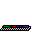

# <div align="center"></div>

# I'm Sandra Samy :)

<table>
  <tr>
    <td align="center" width="25%">
      
      <br><br>
      <strong> Sandra Samy</strong>
      <br>
      <em>Software Engineer</em>
      <br><br>
      
      <br>
      
    </td>
    <td width="75%">
      
```bash
SandraSamy@ubuntu:~$ whoami
software-engineer

SandraSamy@ubuntu:~$ cat ~/.profile
```
```
NAME:     Sandra Samy
ROLE:     Software Engineer
UNIVERSITY: Assuit National University
FOCUS:    Mobile App Development & DevOps
MOTTO:    "Building scalable, user-friendly applications"
STACK:    Flutter | .NET | Docker | Ubuntu
```
      
  </tr>
</table>


#  STATS

<div align="center">


<table>
  <tr>
<td></td>


<!-- &exclude={exclude} -->

<td></td>


<!-- &exclude={exclude} -->

 <td></td>

  </tr>
</table>
</tr>
</div>


#  TECH STACK


### **Languages**


### **Frameworks & Tools**


### **DevOps & OS**


### **Databases**


#  Socials

<div align="center">
  <table>
    <tr>
      <td align="center">
        
        <br>
        <strong>Email</strong>
        <br>
        <a href="mailto:sandrasamydev@gmail.com">sandrasamydev@gmail.com</a>

  <td align="center">
        
        <br>
        <strong>LinkedIn</strong>
        <br>
        <a href="https://linkedin.com/in/sandra-samy-sedky">@sandra-samy-sedky</a>
   <td align="center">
        
        <br>
        <strong>Dev.to</strong>
        <br>
        <a href="https://dev.to/sandrasamydev">@sandrasamydev</a>

  <td align="center">
        
        <br>
        <strong>Portfolio</strong>
        <br>
        <a href="https://SandraSamyDev.github.io/portfolio/">Sandra Samy</a>
      </td>

  </table>
</div>


##  2026 GOALS 

- [ ]  Ship 2 Flutter apps to production *(Currently building #1)*
- [ ]  Get Docker Certified *(Studying for exam)*
- [ ]  Deploy full-stack app on Kubernetes *(Planning phase)*
- [ ]  Write 2 essays (no AI) *(1 down, 1 to go!)*
- [ ]  Revise old programming concepts (no AI) *(Starting next month)*


```bash
$ echo "Thanks for stopping by! :)"
> Thanks for stopping by!":)"
```


**If you like this README, consider starring my repos!**

</div
